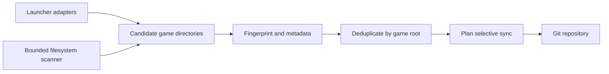

# mc_manager

Find local Minecraft installations, see what changed, and save selected modpack files
to Git. Works on Linux, Windows and macOS with Python 3.11+ and Git. No third-party
runtime packages are required.

## Installation and first launch

There are **two different repositories**: the `mc_manager` source code and a separate
Git repository for Minecraft builds. Clone the source from
`https://github.com/sr9ch/mc_manager.git`. If you already have the `mc_manager` folder,
start at `cd mc_manager`. The commands use a virtual environment inside the source
folder; they do not change the system Python installation.

### Linux

1. Install Python 3.11 or newer and Git. For Fedora:

   ```bash
   sudo dnf install python3 python3-pip git
   python3 --version
   git --version
   ```

   On Debian/Ubuntu, use `sudo apt install python3 python3-venv python3-pip git`.
   Check that `python3 --version` prints 3.11 or newer.
2. Clone and install `mc_manager`:

   ```bash
   git clone https://github.com/sr9ch/mc_manager.git mc_manager
   cd mc_manager
   python3 -m venv .venv
   .venv/bin/python -m pip install .
   .venv/bin/mc_manager scan
   ```

3. Set your Git author identity and connect the Minecraft builds repository:

   ```bash
   git config --global user.name "Your Name"
   git config --global user.email "you@example.com"
   .venv/bin/mc_manager config --setup
   ```

   At the repository prompt, paste `https://github.com/sr9ch/mc_versions.git` (or
   your own Git URL). Press Enter to use the default local clone. To review and sync,
   run `.venv/bin/mc_manager sync --dry-run` and then `.venv/bin/mc_manager`.
   Choose all new builds, none, or answer once for each build when prompted.
   For later launches from another directory, use the absolute path to
   `mc_manager/.venv/bin/mc_manager`.

### Windows (PowerShell)

1. Install [Python 3.11+](https://www.python.org/downloads/windows/) with the Python
   launcher (`py`) and [Git for Windows](https://git-scm.com/download/win). Open a new
   PowerShell window and check `py -3 --version` and `git --version`.
2. Clone and install `mc_manager`:

   ```powershell
   git clone https://github.com/sr9ch/mc_manager.git mc_manager
   cd mc_manager
   py -3 -m venv .venv
   .\.venv\Scripts\python.exe -m pip install .
   .\.venv\Scripts\mc_manager.exe scan
   ```

3. Set your Git identity and connect the Minecraft builds repository:

   ```powershell
   git config --global user.name "Your Name"
   git config --global user.email "you@example.com"
   .\.venv\Scripts\mc_manager.exe config --setup
   ```

   Paste `https://github.com/sr9ch/mc_versions.git` (or your own Git URL) at the
   repository prompt. Press Enter for the default clone under `%LOCALAPPDATA%`.
   Check with
   `.\.venv\Scripts\mc_manager.exe sync --dry-run`; run
   `.\.venv\Scripts\mc_manager.exe` to choose which new builds to synchronize.
   Use the full path to that `.exe`
   for later launches from another folder. Activation is optional, so PowerShell's
   script execution policy does not need to change.

### macOS (Terminal)

1. Install Python 3.11 or newer and Git. Check `python3 --version` and
   `git --version`; install Python from [python.org](https://www.python.org/downloads/macos/)
   if the available Python is older than 3.11. Install the Xcode Command Line Tools
   (`xcode-select --install`) if Git is missing.
2. Clone and install `mc_manager`:

   ```bash
   git clone https://github.com/sr9ch/mc_manager.git mc_manager
   cd mc_manager
   python3 -m venv .venv
   .venv/bin/python -m pip install .
   .venv/bin/mc_manager scan
   ```

3. Set your Git identity and connect the Minecraft builds repository:

   ```bash
   git config --global user.name "Your Name"
   git config --global user.email "you@example.com"
   .venv/bin/mc_manager config --setup
   ```

   Paste `https://github.com/sr9ch/mc_versions.git` (or your own Git URL), press
   Enter for the default clone under `~/Library/Application Support/mc_manager`.
   Run `.venv/bin/mc_manager sync --dry-run`,
   then `.venv/bin/mc_manager`. Use the absolute path to the executable for later
   launches from another folder.

Every `mc_manager` launch scans installed launchers and game directories, comparing
new or missing instances, installed Minecraft and loader versions, and modpack files
with the previous scan. It checks **local installations**, not new Minecraft releases
on the internet. A first scan saves a baseline; you can run scans without any Git
repository. `config --setup` connects a repository when you are ready.
In the remaining examples, `mc_manager` means the executable inside `.venv` shown
above, unless you have activated the virtual environment or installed it with pipx.

## Choose a repository

Use a **separate Git repository for Minecraft content**. Do not select this project's
source-code repository. A new, empty private repository is the simplest choice;
private visibility is prudent because mod configurations can contain personal data.
`mc_manager` does not create a remote repository for you.

Two setup options are supported:

1. **Existing local working tree.** Create one if needed:

   Linux/macOS:

   ```bash
   mkdir -p ~/minecraft-configs
   git -C ~/minecraft-configs init
   git -C ~/minecraft-configs config user.name "Your Name"
   git -C ~/minecraft-configs config user.email "you@example.com"
   mc_manager config --setup
   ```

   Windows PowerShell:

   ```powershell
   New-Item -ItemType Directory -Force "$env:USERPROFILE\minecraft-configs" | Out-Null
   git -C "$env:USERPROFILE\minecraft-configs" init
   git -C "$env:USERPROFILE\minecraft-configs" config user.name "Your Name"
   git -C "$env:USERPROFILE\minecraft-configs" config user.email "you@example.com"
   .\.venv\Scripts\mc_manager.exe config --setup
   ```

   At the repository prompt enter `~/minecraft-configs` on Linux/macOS, or the
   expanded absolute path on Windows (for example, `C:/Users/Alex/minecraft-configs`).
   The path must be the Git
   repository root, not a subdirectory or bare repository. It must be separate from
   every Minecraft game directory. `mc_manager` accepts `~` or an absolute path;
   a relative path is interpreted from the shell's current directory.

2. **Existing remote repository.** Create an empty private repository at your Git
   provider, then run `mc_manager config --setup` and paste its **clone URL**:

   ```text
   git@github.com:USER/minecraft-configs.git
   ssh://git@example.org/USER/minecraft-configs.git
   https://github.com/USER/minecraft-configs.git
   ```

   The names above are placeholders. The same URL forms work with other Git servers.
   Press Enter for the default local clone (Linux:
   `~/.local/share/mc_manager/repository`; Windows:
   `%LOCALAPPDATA%\mc_manager\repository`; macOS:
   `~/Library/Application Support/mc_manager/repository`), or enter another unused
   local path.
   SSH authentication or a Git credential helper must already work. Passwords,
   tokens, URL queries, `http://`, and `file://` clone URLs are not accepted.

Before the first synchronization, configure `user.name` and `user.email` in the chosen
local repository. For a direct remote clone at the default Linux path, run:

```bash
git -C ~/.local/share/mc_manager/repository config user.name "Your Name"
git -C ~/.local/share/mc_manager/repository config user.email "you@example.com"
```

Then run `mc_manager` again. If you chose another clone path, use that path in both
commands. The repository must be clean before every sync. Setting `git_commit = false`
leaves changes for you to commit manually; the next sync will wait until the repository
is clean. After setup:

```bash
mc_manager scan
mc_manager status
mc_manager sync --dry-run
mc_manager
```

The final command asks once about each new build: choose **all**, **none**, or
**each** and answer yes/no per build. Decisions are saved locally. On later runs,
previously approved builds sync automatically; declined builds stay excluded for
that version. If the Minecraft or loader version changes, the build gets a new
decision. Commit is automatic when `git_commit = true`; push runs only when
`git_push = true`. A local-only repository has no push target until you add a remote.

If the Git URL requires sign-in, configure your Git credential helper or SSH key
first. GitHub account passwords are not accepted in HTTPS URLs; use a supported
credential flow. The wizard rejects credentials embedded in a URL.

## What it does

- Finds launcher instances and unknown Minecraft installations on every run.
- Compares every scan with the previous one, including locally installed versions
  and eligible modpack files. The quick comparison uses file size and modification
  time; synchronization separately verifies file contents with SHA-256.
- Reads Prism components, launcher profiles, and version JSON for Minecraft and loader
  versions. Values are marked `detected`, `inferred`, or `unknown`.
- Merges results that point to the same physical game directory, so shared launcher
  directories are synchronized once.
- Excludes the configured Git repository from filesystem discovery, including after
  synchronized files have been added to it.
- Synchronizes `mods`, `shaderpacks`, `resourcepacks`, `config`, `defaultconfigs`,
  `kubejs`, `scripts`, `patchouli_books`, root `datapacks`, and
  `saves/<world>/datapacks` without copying the world itself.
- Detects additions, edits, and deletions, with a manifest of managed files and hashes.
- Uses Git fast-forward pull only when explicitly enabled. Automatic commit and push
  follow configuration. It never runs `reset --hard` or `clean -fd`.

Example output from a scan:

```text
$ mc_manager scan
Minecraft Manager 1.0.0
Scanning local installations...

2 launchers detected; 2 unique installations

Launchers
  ✓ Prism Launcher — installed, no instances
  ✓ SKLauncher — 2 installations

Installations
  • 1.21.11 — SKLauncher
    Minecraft 1.21.11 · fabric 0.19.5 [detected]
  • 26.3 — SKLauncher
    Minecraft 26.3 · quilt 0.31.0-beta.4 [detected]

Changes since last scan
  First scan saved as baseline.
```

## Discovery

Known adapters and the generic filesystem scanner both produce `MinecraftInstance`
records. A shared pipeline merges them by the game directory's device and inode.
The launcher is metadata; the physical game directory is the identity used for sync.



The generic scanner checks the platform's Minecraft, application configuration and
data directories, plus known launcher roots (including Flatpak on Linux). It
visits at most 4,000 directories and descends at most six levels from each search
root. Large unrelated trees, caches and symlinks are skipped. A candidate needs
several Minecraft indicators: `versions`, `libraries`, `assets`, launcher profiles,
`options.txt`, and/or a combination of content directories. A lone `mods` folder is
rejected. `mc_manager scan --debug` shows scores, indicators, metadata sources,
rejections and deduplication decisions. `scan --force` performs the same full live
scan; no discovery cache currently exists.

| Launcher | Instance source | Metadata | Status |
| --- | --- | --- | --- |
| Prism Launcher | `instances/*/mmc-pack.json` and `instance.cfg` | Component versions | Supported |
| MultiMC | Same MMC layout | Component versions | Supported for standard layout |
| SKLauncher | `~/.sklauncher/instances.json`, installations metadata | Version JSON and installation fields | 4.0 layout tested; older layouts experimental |
| Legacy Launcher | `.tlauncher/legacy.properties`, installer `tl.properties`, game `versions`, and `home/*` | Selected version JSON or inferred subfolder name | Supported for standard and subfolder layouts; portable custom paths need a configured root |
| TLauncher | `tlauncher-2.0.properties` and game `versions` | Selected version JSON | Experimental |
| Minecraft Launcher | `launcher_profiles.json` and `versions` | Profile and version JSON | Supported for profile layout |
| Modrinth App, ATLauncher, CurseForge, GDLauncher | Known instance manifests | Available fields | Experimental; schemas vary by release |
| Unknown/custom | Filesystem fingerprint | Adjacent manifest or version JSON | Supported when fingerprint is strong |

When a shared game root contains several installed versions and no reliable selected
version is available, `mc_manager` reports the version as unknown rather than claiming
each version is a separate instance. SKLauncher 4.0's separate `directory` values are
independent instances; unplayed empty entries are not synchronized.

### Legacy Launcher

For [Legacy Launcher](https://legacylauncher.ru), run `mc_manager scan --debug` after
installing and launching a game version once. The adapter reads the usual
`.tlauncher/legacy.properties` settings (or installer `tl.properties`) and the selected
game folder. Legacy's [Subfolders feature](https://legacylauncher-docs.pages.dev/en/launcher/subfolders)
stores separate builds in `game-directory/home/<family-or-version>`; `mc_manager`
detects these as separate instances. Folder names supply inferred version and loader
values when no version JSON is available. If you use a portable launcher or a
nonstandard settings path, open its game folder from Legacy's folder icon and add
its absolute path to `[roots]` as `legacy = ["/path/to/game-directory"]` in the
`mc_manager` config file. On Windows, use forward slashes or escaped backslashes in
TOML paths, for example `legacy = ["C:/Games/Minecraft"]`. Run `mc_manager scan`
again, then `mc_manager sync --dry-run` to review the build paths.

## Commands

| Command | Effect |
| --- | --- |
| `mc_manager` | Scan, decide once for new builds, and sync approved builds |
| `mc_manager scan [--force] [--debug]` | Scan and display launchers, instances, and recent changes |
| `mc_manager status` | Show pending file and metadata changes |
| `mc_manager sync [name] [--dry-run]` | Preview or sync approved builds, optionally matching a name |
| `mc_manager sync --all-new` | Approve all newly found builds and sync without prompts |
| `mc_manager sync --skip-new` | Decline all newly found builds without prompts |
| `mc_manager sync "Pack" --reconsider` | Ask again for one build's current version |
| `mc_manager clients` | Show launcher discovery results |
| `mc_manager instances` | Show unique game directories |
| `mc_manager config` | Show configuration path and repository |
| `mc_manager config --setup` | Run the setup wizard again |
| `mc_manager --version` | Show installed version |

Large change plans show totals by change type and directory, followed by the first
12 paths. Use `mc_manager --verbose status` or `mc_manager --verbose sync --dry-run`
to see every path and more discovery details. The global `--verbose` flag goes before
the command.

`scan` never writes repository content. `status` and `sync --dry-run` only inspect
content, except that an interrupted prior sync is rolled back before inspection.
In a noninteractive run, undecided new builds are skipped until you choose in a
terminal or pass `--all-new` or `--skip-new`. Previously approved builds can sync
without a prompt. The legacy `ask_before_sync` config field remains readable for
older installations but no longer controls this approval flow.

## Repository layout and configuration

The destination stays stable across version changes and display-name edits. Minecraft
version and loader live in the manifest, avoiding duplicate copies after upgrades.
If two instances would have the same slug, the second gets a deterministic short
suffix. The local configuration remembers each game directory's destination.

```text
minecraft/
└── prism/
    └── better-mc/
        ├── mods/
        ├── config/
        ├── datapacks/my-world-<hash>/
        └── mc_manager.json
```

`mc_manager.json` records the launcher names, Minecraft/loader metadata, last sync
time, and SHA-256 hashes of managed files. It contains no absolute machine paths.
World slugs include a short hash to prevent collisions between similar names.

Configuration is human-readable TOML. Default locations:

| OS | Config | Scan history | Remote clone |
| --- | --- | --- | --- |
| Linux | `~/.config/mc_manager/config.toml` | `~/.local/state/mc_manager/seen.json` | `~/.local/share/mc_manager/repository` |
| Windows | `%APPDATA%\mc_manager\config.toml` | `%LOCALAPPDATA%\mc_manager\seen.json` | `%LOCALAPPDATA%\mc_manager\repository` |
| macOS | `~/Library/Application Support/mc_manager/config.toml` | `~/Library/Application Support/mc_manager/seen.json` | `~/Library/Application Support/mc_manager/repository` |

The `XDG_CONFIG_HOME`, `XDG_STATE_HOME`, and `XDG_DATA_HOME` environment variables
override those defaults on any platform.

```toml
[repository]
path = "/path/to/existing/git-repo"

[sync]
ask_before_sync = true
git_commit = true
git_push = false
git_pull = false
ignores = ["mods/private-*", "config/local.json"]

[selection]
excluded_clients = []
excluded_instances = []

[roots]
prism = ["/path/to/portable/PrismLauncher/instances"]

# The tool writes remembered yes/no answers to [decisions] automatically.
```

A game directory can also contain `.mcmanagerignore` with one glob per line. Patterns
match paths relative to that game directory's synchronized content. The ignore file
itself is never copied.

## Safety and limits

Only the listed content directories are read. Logs, screenshots, caches, libraries,
assets, runtime files, account data, secret-looking filenames and text containing
common credential keys are skipped. Eligible symlinked content blocks synchronization;
repository deletions are restricted to manifest-owned files whose
hash still matches. Existing unmanaged files block a collision. A dirty Git repository
blocks sync, and pull uses `--ff-only` when enabled. No Minecraft files are modified.
Repository writes are staged together; an interrupted synchronization is rolled
back before the next repository operation. A lock prevents simultaneous
`mc_manager` operations on the same repository.

The content scanner hashes eligible files for an accurate change plan; a very large
modpack may take time to scan. Files larger than 100 MiB and text-like files larger
than 4 MiB are skipped. Secret detection is intentionally conservative but cannot
prove an arbitrary mod configuration contains no private information; review the
planned changes and Git diff before publishing a repository. Alternate launcher
schemas and portable installations may require explicit roots or adapter updates.
Generic discovery is bounded, so directories beyond its depth or
visit limit need a configured root or launcher adapter.

## Development

Core modules are under `src/mc_manager/`: `discovery.py` and
`shared_launchers.py` hold adapters and metadata readers; `generic.py` supplies
bounded filesystem discovery; `sync.py` plans and applies content changes;
`safety.py` guards paths and filters files; `transaction.py` applies recoverable
repository writes; `git.py` handles Git and locking; `paths.py` selects platform
locations; `config.py` stores settings; `cli.py` provides the terminal workflow.
Fixture-based tests live in
`tests/`.

```bash
pytest
ruff check .
ruff format --check .
```

See [CONTRIBUTING.md](CONTRIBUTING.md) for adapter guidelines. Licensed under the
[MIT License](LICENSE).
