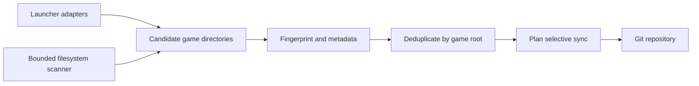

# mc_manager

Find local Minecraft installations, see what changed, and save selected modpack files
to Git. Designed for Fedora Linux and XDG directories. Runs on Python 3.11+ with no
third-party runtime dependencies.

## Quick start

From a checkout of this project:

```bash
pipx install .
mc_manager
```

Run `mc_manager` from any terminal whenever you want to check your installations.
Every launch scans local launchers and game directories, then compares them with the
previous scan. It reports new or missing launchers and instances, changed Minecraft
or loader versions, and added, edited, or removed modpack files. The first scan saves
a baseline and offers Git setup when run interactively. Press Enter to continue
without a repository; connect one only if you want to synchronize selected content.
This checks versions installed on your computer, not new Minecraft releases on the
internet.

To connect a repository, run `mc_manager config --setup`. For a remote URL,
`mc_manager` clones a local copy under your XDG data directory unless you choose
another location. The wizard lists discovered installations and lets you exclude
clients or individual game directories. Once configured, `mc_manager` also shows
pending repository changes and asks before synchronizing.

For a development checkout:

```bash
python -m venv .venv
source .venv/bin/activate
pip install -e ".[dev]"
mc_manager scan
```

No repository URL is embedded in this project. To install from a remote source, clone
its actual URL first, change into the checkout, then run `pipx install .`.

## Choose a repository

Use a **separate Git repository for Minecraft content**. Do not select this project's
source-code repository. A new, empty private repository is the simplest choice;
private visibility is prudent because mod configurations can contain personal data.
`mc_manager` does not create a remote repository for you.

Two setup options are supported:

1. **Existing local working tree.** Create one if needed:

   ```bash
   mkdir -p ~/minecraft-configs
   git -C ~/minecraft-configs init
   git -C ~/minecraft-configs config user.name "Your Name"
   git -C ~/minecraft-configs config user.email "you@example.com"
   mc_manager config --setup
   ```

   At the repository prompt enter `~/minecraft-configs`. The path must be the Git
   repository root, not a subdirectory or bare repository. It must be separate from
   every Minecraft game directory. `mc_manager` accepts `~` or an absolute path;
   a relative path is interpreted from the shell's current directory.

2. **Existing remote repository.** Create an empty private repository at your Git
   provider, then run `mc_manager config --setup` and paste its **clone URL**:

   ```text
   git@github.com:USER/minecraft-configs.git
   ssh://git@example.org/USER/minecraft-configs.git
   https://github.com/USER/minecraft-configs.git
   ```

   The names above are placeholders. The same URL forms work with other Git servers.
   Press Enter for the default local clone at
   `$XDG_DATA_HOME/mc_manager/repository` (usually
   `~/.local/share/mc_manager/repository`), or enter another unused local path.
   SSH authentication or a Git credential helper must already work. Passwords,
   tokens, URL queries, `http://`, and `file://` clone URLs are not accepted.

At the exclusion prompts, press Enter to include all detected instances and launchers.
Before the first synchronization, configure `user.name` and `user.email` in the chosen
local repository. For a direct remote clone at the default path, decline the first
sync prompt and run:

```bash
git -C ~/.local/share/mc_manager/repository config user.name "Your Name"
git -C ~/.local/share/mc_manager/repository config user.email "you@example.com"
```

Then run `mc_manager` again. If you chose another clone path, use that path in both
commands. The repository must be clean before every sync. Setting `git_commit = false`
leaves changes for you to commit manually; the next sync will wait until the repository
is clean. After setup:

```bash
mc_manager scan
mc_manager status
mc_manager sync --dry-run
mc_manager
```

The final command shows changes and asks before copying. After copying it offers a
Git commit and, when `origin` exists, a push. A local-only repository has no push
target until you add a remote.

## What it does

- Finds launcher instances and unknown Minecraft installations on every run.
- Compares every scan with the previous one, including locally installed versions
  and eligible modpack files. The quick comparison uses file size and modification
  time; synchronization separately verifies file contents with SHA-256.
- Reads Prism components, launcher profiles, and version JSON for Minecraft and loader
  versions. Values are marked `detected`, `inferred`, or `unknown`.
- Merges results that point to the same physical game directory, so shared launcher
  directories are synchronized once.
- Excludes the configured Git repository from filesystem discovery, including after
  synchronized files have been added to it.
- Synchronizes `mods`, `shaderpacks`, `resourcepacks`, `config`, `defaultconfigs`,
  `kubejs`, `scripts`, `patchouli_books`, root `datapacks`, and
  `saves/<world>/datapacks` without copying the world itself.
- Detects additions, edits, and deletions, with a manifest of managed files and hashes.
- Uses Git fast-forward pull only when explicitly enabled, and offers commit and push
  after synchronization. It never runs `reset --hard` or `clean -fd`.

Example output from a scan:

```text
$ mc_manager scan
Minecraft Manager

Scanning clients...

✓ Prism Launcher: 0 installations
✗ Legacy Launcher: not found
✗ TLauncher: not found
✓ SKLauncher: 2 installations
  └─ 1.21.11: 1.21.11, fabric 0.19.5 [detected]
  └─ 26.3: 26.3, quilt 0.31.0-beta.4 [detected]

2 launchers detected; 2 unique installations
Discovery: generic 2; duplicates merged 2
```

## Discovery

Known adapters and the generic filesystem scanner both produce `MinecraftInstance`
records. A shared pipeline merges them by the game directory's device and inode.
The launcher is metadata; the physical game directory is the identity used for sync.



The generic scanner checks `~/.minecraft`, `~/.sklauncher/instances`, XDG config,
data and state directories, Flatpak application data, and known adapter roots. It
visits at most 4,000 directories and descends at most six levels from each search
root. Large unrelated trees, caches and symlinks are skipped. A candidate needs
several Minecraft indicators: `versions`, `libraries`, `assets`, launcher profiles,
`options.txt`, and/or a combination of content directories. A lone `mods` folder is
rejected. `mc_manager scan --debug` shows scores, indicators, metadata sources,
rejections and deduplication decisions. `scan --force` performs the same full live
scan; no discovery cache currently exists.

| Launcher | Instance source | Metadata | Status |
| --- | --- | --- | --- |
| Prism Launcher | `instances/*/mmc-pack.json` and `instance.cfg` | Component versions | Supported |
| MultiMC | Same MMC layout | Component versions | Supported for standard layout |
| SKLauncher | `~/.sklauncher/instances.json`, installations metadata | Version JSON and installation fields | 4.0 layout tested; older layouts experimental |
| Legacy Launcher | `legacy.properties` and game `versions` | Selected version JSON | Experimental; subfolder modes may need manual roots |
| TLauncher | `tlauncher-2.0.properties` and game `versions` | Selected version JSON | Experimental |
| Minecraft Launcher | `launcher_profiles.json` and `versions` | Profile and version JSON | Supported for profile layout |
| Modrinth App, ATLauncher, CurseForge, GDLauncher | Known instance manifests | Available fields | Experimental; schemas vary by release |
| Unknown/custom | Filesystem fingerprint | Adjacent manifest or version JSON | Supported when fingerprint is strong |

When a shared game root contains several installed versions and no reliable selected
version is available, `mc_manager` reports the version as unknown rather than claiming
each version is a separate instance. SKLauncher 4.0's separate `directory` values are
independent instances; unplayed empty entries are not synchronized.

## Commands

| Command | Effect |
| --- | --- |
| `mc_manager` | Scan, show changes since the last launch, then offer sync if configured |
| `mc_manager scan [--force] [--debug]` | Scan and display launchers, instances, and recent changes |
| `mc_manager status` | Show pending file and metadata changes |
| `mc_manager sync [name] [--dry-run]` | Sync all enabled instances or a matching name |
| `mc_manager clients` | Show launcher discovery results |
| `mc_manager instances` | Show unique game directories |
| `mc_manager config` | Show configuration path and repository |
| `mc_manager config --setup` | Run the setup wizard again |
| `mc_manager --version` | Show installed version |

Large change plans show totals by change type and directory, followed by the first
12 paths. Use `mc_manager --verbose status` or `mc_manager --verbose sync --dry-run`
to see every path. The global `--verbose` flag goes before the command.

`status`, `scan`, and `sync --dry-run` never copy or delete Minecraft content. A
noninteractive invocation with `ask_before_sync = true` prints the plan and skips
sync. Set it to `false` only if unattended synchronization is intended.

## Repository layout and configuration

The destination stays stable across version changes and display-name edits. Minecraft
version and loader live in the manifest, avoiding duplicate copies after upgrades.
If two instances would have the same slug, the second gets a deterministic short
suffix. The local configuration remembers each game directory's destination.

```text
minecraft/
└── prism/
    └── better-mc/
        ├── mods/
        ├── config/
        ├── datapacks/my-world-<hash>/
        └── mc_manager.json
```

`mc_manager.json` records the launcher names, Minecraft/loader metadata, last sync
time, and SHA-256 hashes of managed files. It contains no absolute machine paths.
World slugs include a short hash to prevent collisions between similar names.

Configuration is human-readable TOML at `$XDG_CONFIG_HOME/mc_manager/config.toml`,
or `~/.config/mc_manager/config.toml`. Scan history is stored in
`$XDG_STATE_HOME/mc_manager/seen.json` with owner-only permissions. A remote clone defaults to
`$XDG_DATA_HOME/mc_manager/repository`.

```toml
[repository]
path = "/path/to/existing/git-repo"

[sync]
ask_before_sync = true
git_commit = true
git_push = false
git_pull = false
ignores = ["mods/private-*", "config/local.json"]

[selection]
excluded_clients = []
excluded_instances = []

[roots]
prism = ["/path/to/portable/PrismLauncher/instances"]
```

A game directory can also contain `.mcmanagerignore` with one glob per line. Patterns
match paths relative to that game directory's synchronized content. The ignore file
itself is never copied.

## Safety and limits

Only the listed content directories are read. Logs, screenshots, caches, libraries,
assets, runtime files, account data, secret-looking filenames and text containing
common credential keys are skipped. Symlinked source files and destination paths are
rejected or skipped; repository deletions are restricted to manifest-owned files whose
hash still matches. Existing unmanaged files block a collision. A dirty Git repository
blocks sync, and pull uses `--ff-only` when enabled. No Minecraft files are modified.

The content scanner hashes eligible files for an accurate change plan; a very large
modpack may take time to scan. Files larger than 100 MiB and text-like files larger
than 4 MiB are skipped. Secret detection is intentionally conservative but cannot
prove an arbitrary mod configuration contains no private information; review the
planned changes and Git diff before publishing a repository. Alternate launcher
schemas and Legacy Launcher subfolder modes may require explicit roots or future
adapter updates. Generic discovery is bounded, so directories beyond its depth or
visit limit need a configured root or launcher adapter.

## Development

Core modules are under `src/mc_manager/`: `discovery.py` and
`shared_launchers.py` hold adapters and metadata readers; `generic.py` supplies
bounded filesystem discovery; `sync.py` plans and applies content changes;
`safety.py` guards paths and filters files; `git.py` handles Git; `config.py` stores
XDG settings; `cli.py` provides the terminal workflow. Fixture-based tests live in
`tests/`.

```bash
pytest
ruff check .
ruff format --check .
```

See [CONTRIBUTING.md](CONTRIBUTING.md) for adapter guidelines. Licensed under the
[MIT License](LICENSE).
